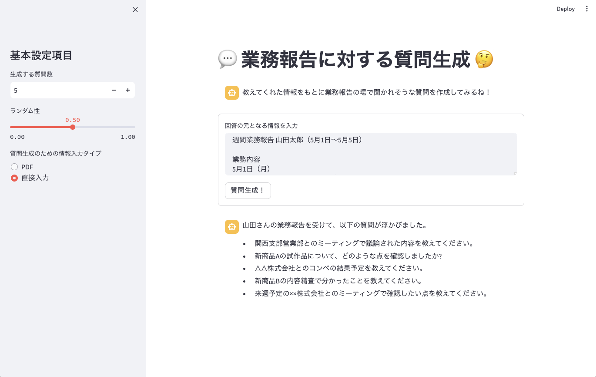

# 生成 AI サンプルアプリ - 業務報告に対する質問生成

業務報告を提供すると、その情報を考慮して報告の場でされそうな質問を生成するアプリです。



## アプリ開発手順

### ライブラリのインストール
```sh
cd app

# (Option) venv 環境構築
# python -m venv .venv
# source .venv/bin/activate

pip install -r requirements.txt
```

### （オプション） AWS 認証情報の設定

```sh
aws configure
```

### Streamlit の起動

```sh
streamlit run main.py
```

## AWS 環境へのデプロイ（CDK）

```sh
cd cdk

# (Option) venv 環境構築
# python -m venv .venv
# source .venv/bin/activate

pip install -r requirements.txt

# (Option) CDK Bootstrap
# cdk bootstrap

cdk deploy
```